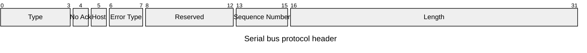

# Embedded 802.11 serial
Project is providing classic Radio Co-Processor solutions for [Zephyr](https://www.zephyrproject.org/) based micro-controllers.

There is an unique(ish) twist with the project where it can support multiplexing multiple protocols over the same serial interface reducing the need for peripheral devices and PCB draws.

The project shall support Linux and Zephyr host drivers.

There are no commercial or otherwise ambitions aims for the project outside seeing if this can be done in efficient manner using the most straight forward ways for the implementation. This is very much a hobby project and there is no timeline for finishing the tasks.

## Architecture
### General approach and technology choices
The project is optimized for Zephyr MCU for now. The wire-protocol between host and MCU is optimized for Zephyr North-bound Wi-Fi, Bluetooth Low-Energy (BLE) and OpenThread APIs.

There is a common header for the frames, but more complex technology specific protocols are defined through [Google Protobufs](https://protobuf.dev/) as the description language for now. Protobuf (De)serialization mechanism are well-understood, efficient and supported natively by Zephyr through [Nanopd](https://jpa.kapsi.fi/nanopb/docs/).

Linux kernel-driver is making the adaption under [cfg80211](https://www.kernel.org/doc/html/v4.12/driver-api/80211/cfg80211.html) API. As Zephyr Wi-Fi management API is based on full-MAC approach, cfg80211 is the most suitable starting point.

The solution has been defined serial interfaces in mind. In principle, any serial-like interface (SPI, SDIO, UART, USB ACM etc.) will work while the initial development focus is centered around USB to make development easier, but it is understood that the actual production implementations are going to be using SPI & SDIO.

C is used as the programming language across hosts and MCU software. Wonderful programming language [Rust](https://www.rust-lang.org/) is used everywhere else. I may consider using Rust for writing Linux kernel-driver if the bindings for cfg80211 are available for the language.

### Serial Medium Access Protocol (MAC)
Serial MAC is providing means to manage the lowest level of interactions between the host and MCU including routing the packets between supported subsystems, abstracting the physical interfaces performing flow-control with serialization between the technology blocks.

The link protocol is defined as:

Diagram is supported in visualized format in later Mermaid plug-in.

Type can take following values:
- 0: Wi-Fi Management message
- 1: Wi-Fi Data
- 2: BLE HCI message
- 3: OpenThread Spinel message
- 4: AT-command (no plans to implement this right now as this is in conflict with RCP approach)
- 5: Ack packet

No Ack field is used for signaling if the sender would like to receive Ack for the message. In general, it is a good idea to use Ack, but in certain high-throughput use cases, it will advantageous to not send Ack for each frame. This feature will not be implemented in phase 1.

Host field provides the system means to signal, if the frame was sent by the host or MCU.

Error Type provides means to signal link-layer signal decision. The technology specific error messages are send as normal data transmissions. The defined error types are:
- 0: No Error
- 1: Incorrect sequence number. The message includes the correct next sequence number in the field
- 2: Buffer overload. This can happen when the system runs out of link-layer buffers. Typically, this should not happen if the protocol is properly followed.
- 3: Reserved for future use.

Sequence Number is used for giving the system nodes the ability to follow where packets buffers are going and where to wait acknowledgement. Sequence Number will wrap over and thus no system shall have more than 6 packets buffered without Ack.

Length defines the length of the data after the header.

### System components
TBD